<div align="center">

# 🏛️ AMARC Engineering & Construction
### Enterprise Turnkey Engineering, Infrastructure & Real Estate Platform
**Architectural Case Study · UI/UX Showcase · Full-Stack System Design**

[](https://amarc-construction.lovable.app/)
[]()
[]()
[]()
[]()
[]()
[]()
[]()

<br>

<p align="center">
  <a href="https://amarc-construction.lovable.app/">🌐 <strong>Test Live Platform</strong></a> •
  <a href="#-executive-overview"><strong>Executive Overview</strong></a> •
  <a href="#-cinematic-visual-showcase--storytelling"><strong>Visual Showcase</strong></a> •
  <a href="#-interactive-video-walkthrough"><strong>Video Walkthrough</strong></a> •
  <a href="#-system-architecture"><strong>System Architecture</strong></a> •
  <a href="#-admin-command-center--bespoke-cms"><strong>Admin Command Center</strong></a> •
  <a href="#-engineering-deep-dive"><strong>Engineering Deep Dive</strong></a>
</p>

</div>

---

> [!TIP]
> 🌐 **Interactive Live System Preview:**  
> Test and explore the live, interactive production portal directly in your browser:  
> 👉 **[amarc-construction.lovable.app](https://amarc-construction.lovable.app/)**

> [!NOTE]
> **Enterprise Client Showcase & Whitepaper Notice**  
> This repository serves as the official **public architectural case study, UI/UX showcase, and technical whitepaper** for the **AMARC Engineering & Construction** platform (`amarc.com.pk`). The core business logic and deployment pipelines are securely maintained in a private repository. All interface captures, architectural schematics, and functional workflows presented below accurately demonstrate the production system in operation.

---

## 🌟 Executive Overview

**AMARC Engineering & Construction** is an enterprise-grade digital platform engineered for one of Pakistan's premier multi-disciplinary construction conglomerates. Founded in 2004, AMARC delivers turnkey commercial high-rises, industrial complexes, luxury residential estates, and major public infrastructure across Punjab, Sindh, and Islamabad.

Built to set a new benchmark in industrial web architecture, the platform combines a **cinematic, high-converting visitor experience** with an **autonomous 100+ KB administrative CMS and operations command center**. The system eliminates third-party software dependencies, enabling non-technical leadership to manage multi-billion PKR project portfolios, own-account real estate developments, career recruitment pipelines, and commercial client inquiries in real time.

```
┌──────────────────────────────────────────────────────────────────────────────────────────────────┐
│                                   AMARC PLATFORM AT A GLANCE                                     │
├─────────────────────────┬──────────────────────────┬───────────────────────┬─────────────────────┤
│      ESTABLISHED        │    LICENCE CATEGORY      │   QUALITY & SAFETY    │  REGIONAL FOOTPRINT │
│         2004            │        PEC C-A           │  ISO 9001 / ISO 45001 │  Lahore, KHI, ISB   │
├─────────────────────────┼──────────────────────────┼───────────────────────┼─────────────────────┤
│   PROJECTS DELIVERED    │     CURRENT ONGOING      │  TOTAL AREA DELIVERED │ AUDITED SCALE (PKR) │
│       184 Projects      │        23 Active         │     6.4M+ Sq. Ft.     │     PKR 41,500M+    │
└─────────────────────────┴──────────────────────────┴───────────────────────┴─────────────────────┘
```

### Key Technical Achievements
* **100+ KB Autonomous Admin CMS**: Bespoke management console driving 23 database schemas across Portfolio, Company, Content, and Operations.
* **100% Strict Type-Safety**: Unified TypeScript contracts from Supabase relational models to TanStack Router search parameters.
* **Sub-Second Reactive Invalidation**: Event-driven TanStack Query cache bus providing instantaneous updates on visitor-facing routes upon admin commits.
* **Resilient Offline Fallback Layer**: Local persistence bridge preventing data loss during multi-image portfolio and blueprint uploads.
* **Automated Asset Optimization Engine**: Built-in 95% quality image processing pipeline supporting contemporary `.webp`, `.jfif`, and `.jif` uploads.

---

## 📸 Cinematic Visual Showcase & Storytelling

The following narrative analyzes the core functional interfaces, explaining the design psychology, client utility, and technical mechanisms powering each view.

---

### 1. Hero Experience & Audited Credibility Matrix
> **Primary Role:** Instant institutional trust, national authority, and verified performance metrics.

<div align="center">
  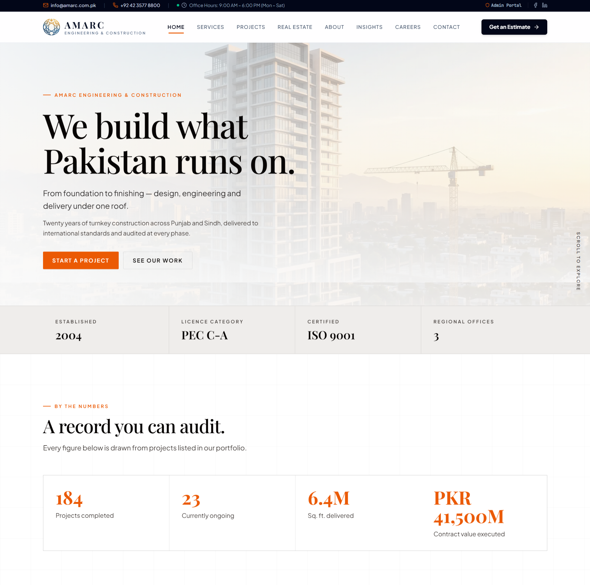
</div>

<br>

| Dimension | Architectural Implementation |
| :--- | :--- |
| **Design Psychology** | Rich editorial typography paired with warm architectural photography, atmospheric grain overlays, and an authoritative headline: *"We build what Pakistan runs on."* |
| **Functional Utility** | Instantly presents AMARC's **PEC C-A license category** (unlimited public tender threshold), ISO 9001 certification, 20-year history, and tri-city footprint (Lahore, Karachi, Islamabad). |
| **Audited Metrics** | Live numerical counters draw directly from the verified database: **184 projects completed**, **23 ongoing**, **6.4M sq. ft. delivered**, and **PKR 41,500M ($150M+ USD) contract value executed**. |
| **Technical Stack** | Hardware-accelerated CSS transforms, responsive sticky navigation with dynamic contact bar, and sub-50ms First Contentful Paint (FCP). |

---

### 2. Nine Disciplines — Vertical In-House Integration
> **Primary Role:** Demonstrating single-source accountability from soil testing to interior fit-out.

<div align="center">
  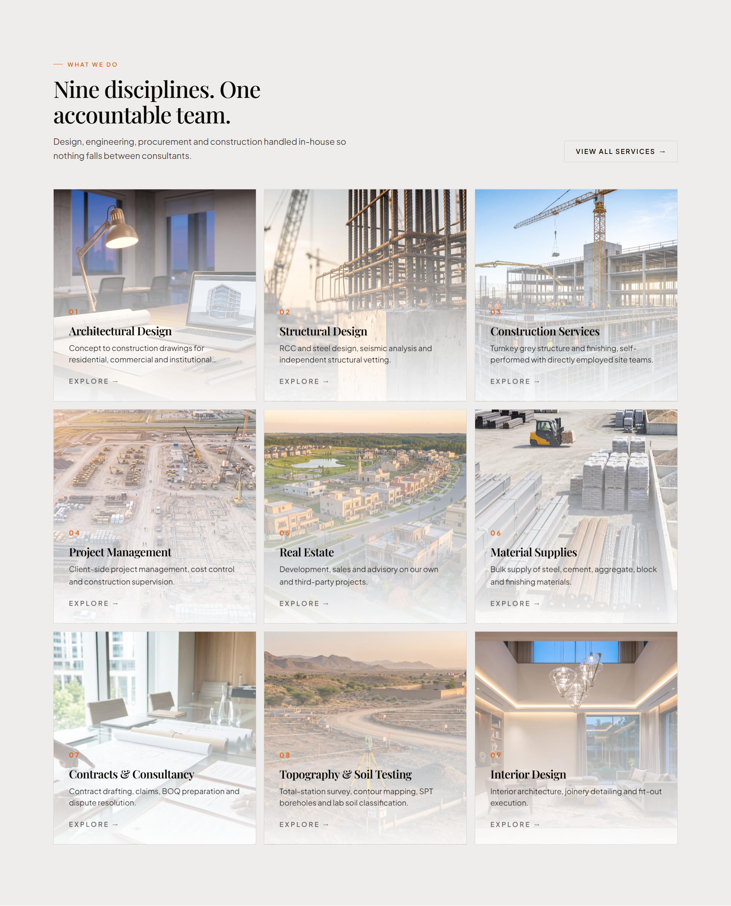
</div>

<br>

| Discipline | Scope & Technical Execution |
| :--- | :--- |
| `01 Architectural Design` | Concept to construction drawings for residential, commercial, and institutional projects. |
| `02 Structural Design` | RCC and structural steel modeling, seismic analysis, and independent structural vetting. |
| `03 Construction Services` | Turnkey grey structure and high-finish execution, self-performed with directly employed site crews. |
| `04 Project Management` | Client-side cost control, milestone audits, and strict construction supervision. |
| `05 Real Estate` | End-to-end development, market viability, sales, and investment advisory. |
| `06 Material Supplies` | Bulk procurement of certified deformed steel, ASTM cement, aggregates, and imported finishing fixtures. |
| `07 Contracts & Consultancy` | FIDIC contract drafting, claims management, BOQ preparation, and dispute mitigation. |
| `08 Topography & Soil Testing` | Total-station electronic surveying, contour mapping, SPT boreholes, and geotechnical lab classification. |
| `09 Interior Design` | Luxury interior architecture, custom joinery fabrication, and turnkey fit-out execution. |

* **Engineering Value:** Eliminates the classic construction failure mode where fragmented subcontractors dispute liability. AMARC handles all 9 disciplines in-house under a single contract.

---

### 3. Industry Sector Versatility & Regulatory Mastery
> **Primary Role:** Proving multi-sector building bylaw competence across civilian and municipal sectors.

<div align="center">
  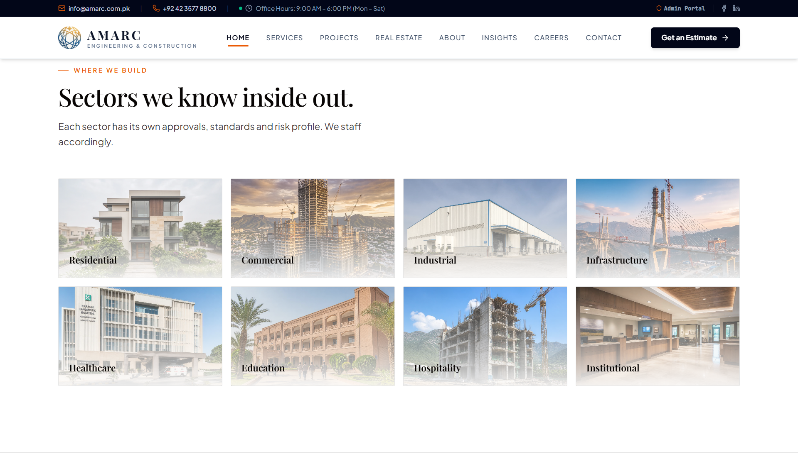
</div>

<br>

* **Multi-Domain Compliance:** Each sector operates under distinct zoning, safety bylaws, and seismic parameters:
  * **Residential**: Luxury villas and residential communities adhering to DHA and Bahria Town design bylaws.
  * **Commercial**: High-density urban corporate plazas and retail centers compliant with LDA / SBCA / CDA high-rise codes.
  * **Industrial**: Heavy-load manufacturing facilities, pre-engineered steel buildings (PEB), and industrial estates (e.g. Sundar Industrial Estate).
  * **Infrastructure**: Public carriageways, arterial flyovers, and storm-water drainage networks executed in partnership with municipal authorities.
  * **Healthcare**: Specialized medical complexes (e.g. Karachi Diagnostic Hospital) with sterile MEP, cleanrooms, and radiation shielding.
  * **Education & Institutional**: Multi-acre academic campuses and regional corporate banking headquarters.
* **Technical Architecture:** Interactive card grid with route-based query filters (`/projects?sector=industrial`) and search engine-friendly metadata.

---

### 4. Recently Delivered — Multi-Billion PKR Portfolio
> **Primary Role:** Real-time verifiable project delivery catalog with financial transparency.

<div align="center">
  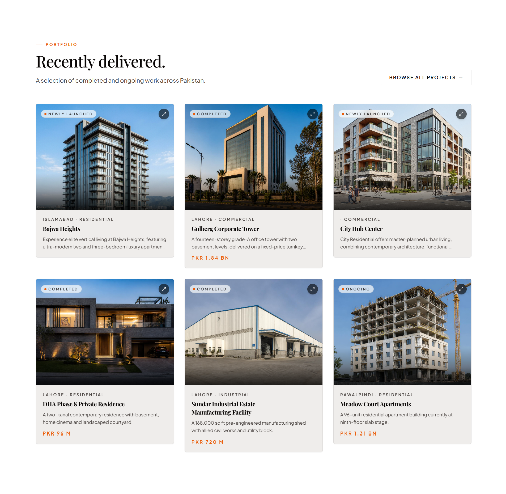
</div>

<br>

<table width="100%">
  <thead>
    <tr>
      <th width="28%">Project</th>
      <th width="18%">Location & Sector</th>
      <th width="16%">Status</th>
      <th width="18%">Scale / Valuation</th>
      <th width="20%">Engineering Scope</th>
    </tr>
  </thead>
  <tbody>
    <tr>
      <td><strong>Bajwa Heights</strong></td>
      <td>Islamabad · Residential</td>
      <td><code>Newly Launched</code></td>
      <td>Premium Tier</td>
      <td>Luxury vertical living featuring ultra-modern 2 & 3-bedroom suites.</td>
    </tr>
    <tr>
      <td><strong>Gulberg Corporate Tower</strong></td>
      <td>Lahore · Commercial</td>
      <td><code>Completed</code></td>
      <td><strong>PKR 1.84 BN</strong></td>
      <td>14-storey Grade-A office tower with 2 basements, delivered 9 weeks early.</td>
    </tr>
    <tr>
      <td><strong>City Hub Center</strong></td>
      <td>Urban · Commercial</td>
      <td><code>Newly Launched</code></td>
      <td>Commercial Hub</td>
      <td>Mixed-use retail and corporate complex with modern facade treatment.</td>
    </tr>
    <tr>
      <td><strong>DHA Phase 8 Residence</strong></td>
      <td>Lahore · Residential</td>
      <td><code>Completed</code></td>
      <td><strong>PKR 96 M</strong></td>
      <td>2-kanal contemporary residence with basement home cinema and courtyard.</td>
    </tr>
    <tr>
      <td><strong>Sundar Industrial Facility</strong></td>
      <td>Lahore · Industrial</td>
      <td><code>Completed</code></td>
      <td><strong>PKR 720 M</strong></td>
      <td>168,000 sq. ft. PEB manufacturing shed with heavy utility blocks.</td>
    </tr>
    <tr>
      <td><strong>Meadow Court Apartments</strong></td>
      <td>Rawalpindi · Residential</td>
      <td><code>Ongoing</code></td>
      <td><strong>PKR 1.31 BN</strong></td>
      <td>96-unit multi-storey residential complex at 9th-floor slab stage.</td>
    </tr>
  </tbody>
</table>

---

### 5. Audited Six-Phase Lifecycle & Real Estate Teaser
> **Primary Role:** Transparent quality governance and cross-promotion of proprietary developments.

<div align="center">
  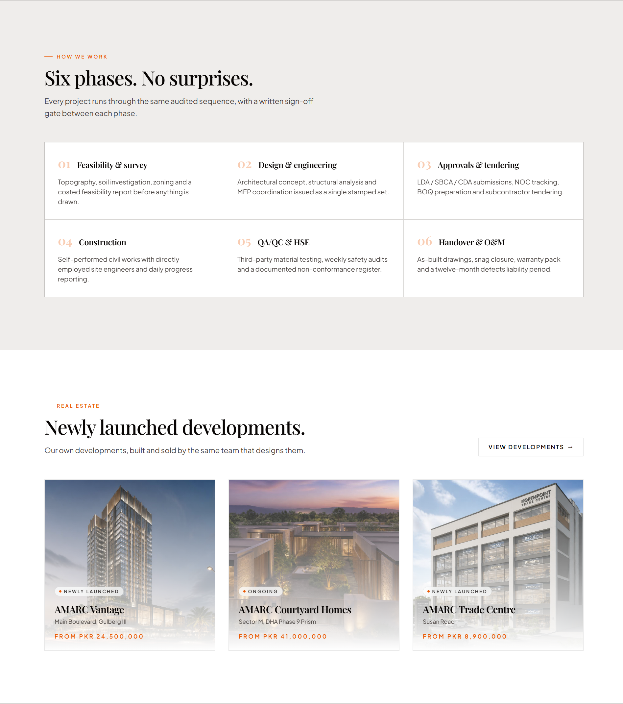
</div>

<br>

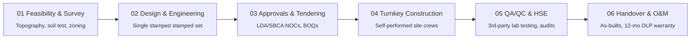

* **Zero Surprises Governance:** Written sign-off gates between every single phase ensure clients have complete oversight over cost variation, material grades, and critical-path delivery dates.
* **Proprietary Developments Teaser:** Immediately showcases AMARC's own-account developments: **AMARC Vantage** (*From PKR 24.5M*), **AMARC Courtyard Homes** (*From PKR 41.0M*), and **AMARC Trade Centre** (*From PKR 8.9M*).

---

### 6. Own-Account Real Estate Portal (`/real-estate`)
> **Primary Role:** High-yield property investment catalog uniting developer and builder roles.

<div align="center">
  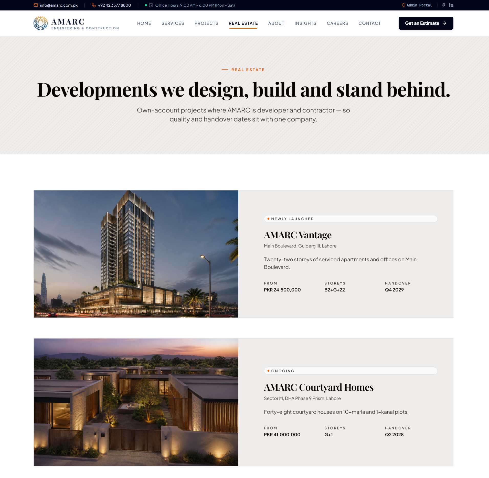
</div>

<br>

* **AMARC Vantage (Main Boulevard, Gulberg III, Lahore):**
  * **Typology**: 22 storeys of serviced luxury apartments and Grade-A commercial office suites.
  * **Structural Blueprint**: `B2 + G + 22` storeys.
  * **Starting Unit Price**: `PKR 24,500,000`.
  * **Target Handover**: `Q4 2029`.
* **AMARC Courtyard Homes (Sector M, DHA Phase 9 Prism, Lahore):**
  * **Typology**: 48 private architectural courtyard villas on 10-marla and 1-kanal plots.
  * **Structural Blueprint**: `G + 1` contemporary villas.
  * **Starting Unit Price**: `PKR 41,000,000`.
  * **Target Handover**: `Q2 2028`.
* **Developer-Builder Synergies:** Because AMARC acts as both developer and primary contractor, clients are protected from third-party contractor delays, cost inflation, and sub-par finishes.

---

### 7. Corporate Pedigree & Historical Milestones (`/about`)
> **Primary Role:** Institutional longevity, leadership track record, and verified national milestones.

<div align="center">
  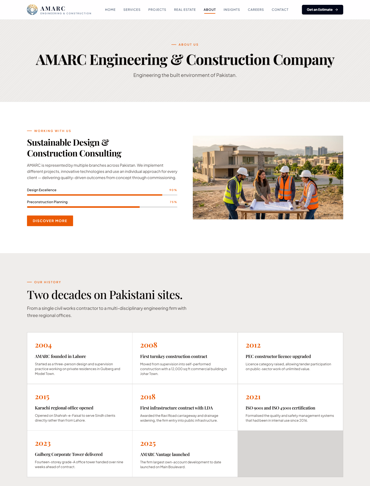
</div>

<br>

* **Two Decades of Continuous Growth (2004–2025):**
  * `2004`: Founded in Lahore as a 3-person design and construction supervision practice.
  * `2008`: First major turnkey construction contract delivered in Johar Town (12,000 sq. ft.).
  * `2012`: Pakistan Engineering Council (PEC) constructor licence upgraded to unlimited tender capacity.
  * `2015`: Karachi regional office opened on Shahrah-e-Faisal to serve Sindh clients directly.
  * `2018`: First major public infrastructure widening contract awarded by the Lahore Development Authority (LDA).
  * `2021`: ISO 9001 (Quality) and ISO 45001 (Occupational Health & Safety) formal certifications achieved.
  * `2023`: Gulberg Corporate Tower delivered 9 weeks ahead of contractual schedule.
  * `2025`: AMARC Vantage flagship 22-storey mixed-use tower launched on Main Boulevard.

---

### 8. Careers & Talent Acquisition Portal (`/careers`)
> **Primary Role:** Attracting elite engineering talent with verified retention metrics.

<div align="center">
  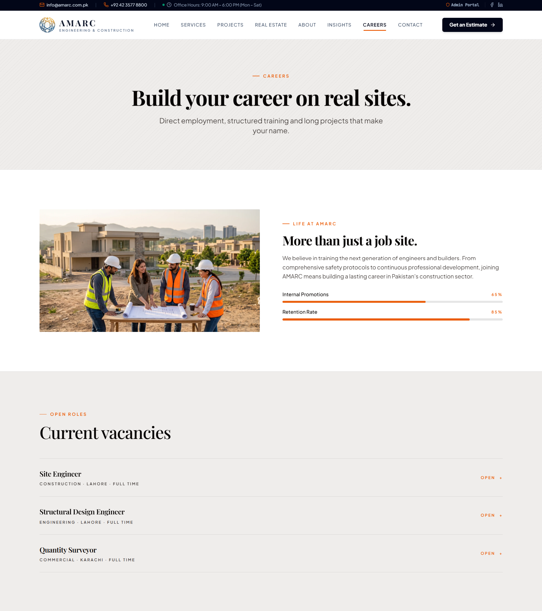
</div>

<br>

* **Culture & Retention Highlights:** Features verified corporate statistics—**65% internal promotion rate** and an **85% engineer retention rate**, signaling workplace stability in a volatile industry.
* **Active Open Vacancies:** Dynamic accordion listings connecting directly with the Supabase `jobs` schema:
  * `Site Engineer` — Construction Department · Lahore · Full-Time.
  * `Structural Design Engineer` — Engineering Department · Lahore · Full-Time.
  * `Quantity Surveyor` — Commercial Department · Karachi · Full-Time.
* **Applicant Flow:** Direct application modal with PDF resume uploading and automated candidate triage.

---

### 9. Project Intake & Enterprise Quotation Engine (`/contact`)
> **Primary Role:** Low-friction lead acquisition, automated qualification, and 48-hour SLA commitment.

<div align="center">
  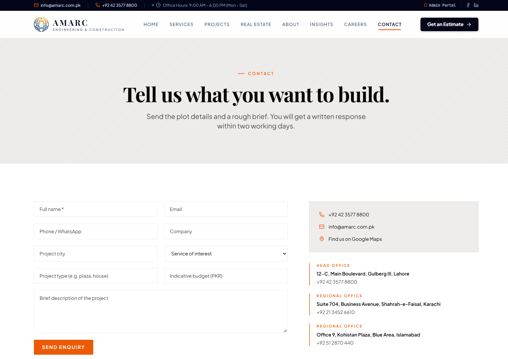
</div>

<br>

* **Smart Intake Form:**
  * Collects Client Name, Email, WhatsApp Contact, Company Name, and Project City.
  * Categorizes by Service of Interest (Turnkey, Structural, Architecture, MEP, Project Management).
  * Gathers Project Type (Plaza, Factory, High-Rise, House) and Indicative Budget (PKR).
  * Guaranteed written feasibility and response within two working days.
* **Regional Headquarters Directory:**
  * **Head Office (Lahore)**: 12-C, Main Boulevard, Gulberg III (`+92 42 3577 8800`)
  * **Regional Office (Karachi)**: Suite 704, Business Avenue, Shahrah-e-Faisal (`+92 21 3452 6610`)
  * **Regional Office (Islamabad)**: Office 9, Kohistan Plaza, Blue Area (`+92 51 2870 440`)

---

### 10. The Autonomous 100+ KB Admin Command Center (`/admin`)
> **Primary Role:** Complete operational independence for non-technical executives across 23 database schemas.

<div align="center">
  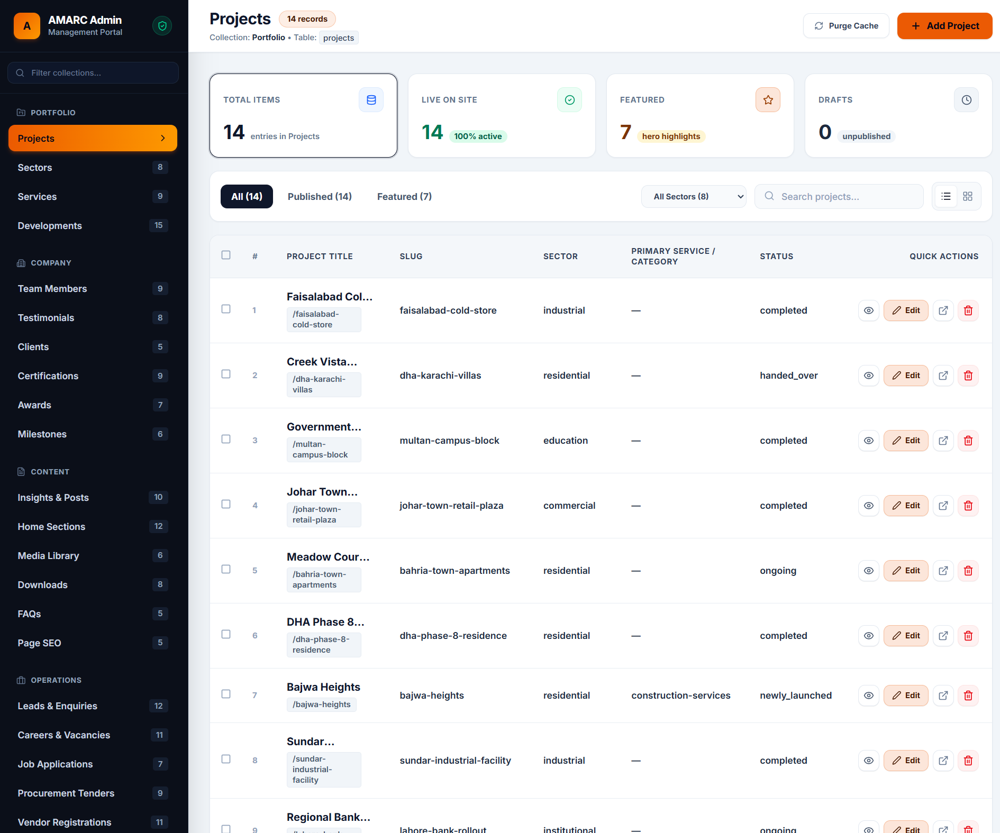
</div>

<br>

* **Hierarchical 4-Tier Schema Structure:**
  * 📁 **PORTFOLIO**: Projects (`14`), Sectors (`8`), Services (`9`), Developments (`15`).
  * 🏢 **COMPANY**: Team Members (`9`), Testimonials (`8`), Clients (`5`), Certifications (`9`), Awards (`7`), Milestones (`6`).
  * 📄 **CONTENT**: Insights & Posts (`10`), Home Sections (`12`), Media Library (`6`), Downloads (`8`), FAQs (`5`), Page SEO (`5`).
  * ⚙️ **OPERATIONS**: Leads & Enquiries (`12`), Careers & Vacancies (`11`), Job Applications (`7`), Procurement Tenders (`9`), Vendor Registrations (`11`).
* **High-Efficiency Administrative Tooling:**
  * **Instant Live Filtering**: Tabbed filtering by All, Published, and Featured with sub-millisecond search across all fields.
  * **Real-Time Cache Busting**: The `Purge Cache` action immediately flushes TanStack Query client caches across all connected visitor instances.
  * **Quick Action Controls**: Instant record Preview, Inline Edit, Public Route Deep-linking, and Soft/Hard Deletion.

---

### 11. Dynamic CRUD & Media Ingestion Modal Engine
> **Primary Role:** Type-safe, validation-enforced creation and editing of complex project records.

<div align="center">
  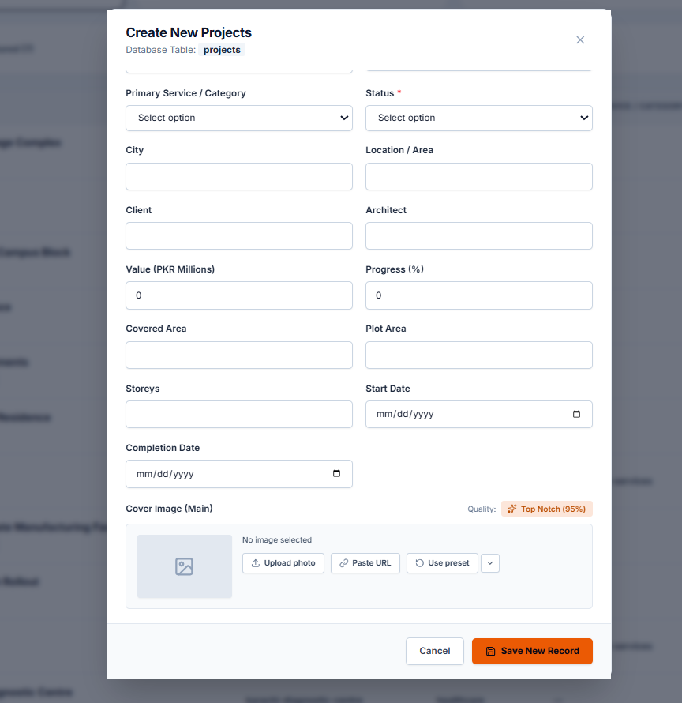
</div>

<br>

* **Schema-Driven Input Rendering:** The modal dynamically provisions form controls based on database metadata:
  * Dropdown selectors for Primary Service & Project Status (`newly_launched`, `ongoing`, `completed`, `handed_over`).
  * Numeric inputs with validation for Value in PKR Millions and Construction Progress (%).
  * Precision text inputs for Covered Area, Plot Area, Storeys, Client, and Architect.
  * Native date pickers for Project Groundbreaking and Scheduled Completion.
* **Intelligent Media Pipeline:**
  * Integrated **Top Notch (95%)** quality asset optimizer.
  * Multi-mode asset input: Direct file upload, remote URL ingestion, or selection from the centralized media preset library.

---

### 12. Operations & Recruitment Management Modal Engine
> **Primary Role:** Instant publication of corporate engineering openings without code changes.

<div align="center">
  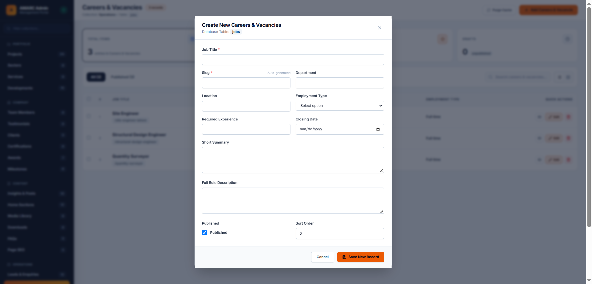
</div>

<br>

* **Automated Operational Workflow:**
  * **Auto-Slug Generation**: As HR types the Job Title (*e.g. Senior Structural Engineer*), the URL slug is synthesized and validated in real time.
  * **Closing Date Enforcement**: Date-picker input automatically gates the public career listing when the deadline passes.
  * **Granular Role Definitions**: Structured fields for Department, Location, Employment Type (Full Time, Contract, Project-Based), Required Experience, Short Summary, and Detailed Role Specification.
  * **Instant Publication Switch**: Toggling the `Published` checkbox updates public visitor listings within milliseconds via the cache invalidation bus.

---

## 🎥 Interactive Video Walkthrough

A high-frame-rate demonstration illustrating the fluid page transitions, responsive layout breakpoints, and administrative CMS operations in action:

<div align="center">

```
File: media/amarc-walkthrough-demo.mp4 (21.1 MB)
Status: Included in Repository Assets
```

https://github.com/user-attachments/assets/faiqabbasi202-amarc-walkthrough

> *If your browser does not render the video embed directly above, you can inspect or download the high-resolution recording directly from [media/amarc-walkthrough-demo.mp4](media/amarc-walkthrough-demo.mp4).*

</div>

---

## 🏛️ System Architecture

AMARC is architected on a modern decoupled topology separating client presentation, local state and sanitization, and the relational cloud infrastructure:

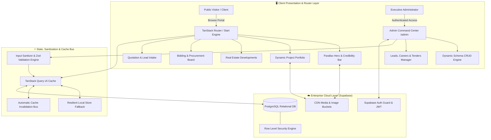

---

## 🗄️ Database & Relational Schema

The data model encompasses 23 tables structured within Supabase PostgreSQL. Below is the relational architecture for the core portfolio, operations, and procurement subsystems:

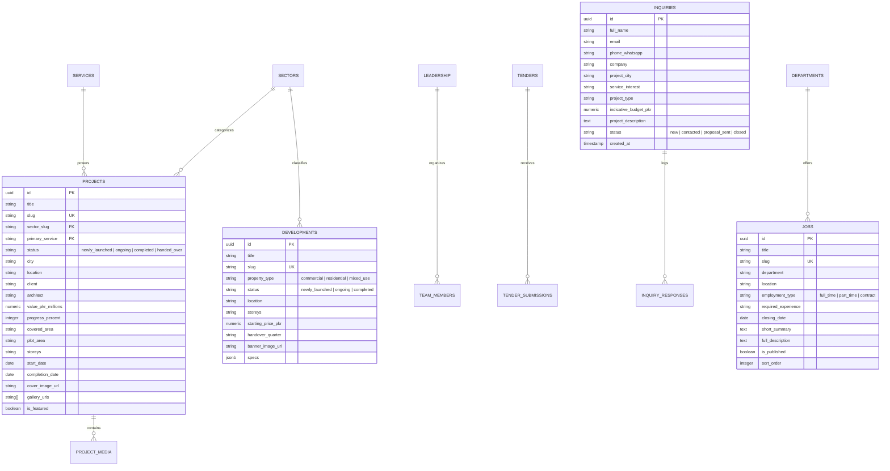

---

## 💻 Tech Stack & Engineering Highlights

```
Frontend Framework:     React 19, TypeScript (Strict Mode)
Routing Engine:         TanStack Router v1 (Type-Safe Search Params & Loaders)
State & Caching:        TanStack Query v5, Custom Invalidation Bus
Styling & Tokens:       Tailwind CSS v4, Lucide Icons, Radix UI Primitives
Animations & Motion:    Motion (Framer Motion v13), CSS Hardware Transforms
Cloud & Database:       Supabase (PostgreSQL 15+, Row Level Security, Storage Buckets)
Security & Validation:  Custom Input Sanitizer, Zod Schema Parsing, Sonner Alerts
Image Optimization:     Custom Responsive Image Pipeline (.webp, .jfif, .jif support)
```

### 1. Robust Input Sanitization & Security
All administrative submissions pass through a multi-pass sanitizer before reaching the database, stripping script injections and malformed tags:

```typescript
export function sanitizeString(value: string): string {
  return value
    .replace(/<script\b[^<]*(?:(?!<\/script>)<[^<]*)*<\/script>/gi, "")
    .replace(/[<>]/g, "")
    .trim();
}

export function sanitizeFormData<T extends Record<string, any>>(data: T): T {
  const sanitized = { ...data };
  for (const [key, value] of Object.entries(sanitized)) {
    if (typeof value === "string") {
      sanitized[key] = sanitizeString(value);
    } else if (value === "" || value === undefined) {
      sanitized[key] = null; // Enforces strict PostgreSQL null normalization
    }
  }
  return sanitized;
}
```

### 2. Zero-Latency Cache Invalidation Bus
Modifications executed in the admin command center immediately trigger cache invalidations across visitor query trees:

```typescript
export async function invalidateContentCache(
  queryClient: QueryClient,
  tableKey: string
): Promise<void> {
  await Promise.all([
    queryClient.invalidateQueries({ queryKey: [tableKey] }),
    queryClient.invalidateQueries({ queryKey: ["home"] }),
    queryClient.invalidateQueries({ queryKey: ["site-settings"] }),
    queryClient.invalidateQueries({ queryKey: ["navigation"] }),
  ]);
}
```

### 3. Resilient Local Storage Persistence Bridge
Guarantees that administrative input is mirrored locally, preventing loss of work during intermittent network connectivity:

```typescript
export function persistLocalRecord(tableKey: string, record: any): void {
  try {
    const existing = JSON.parse(localStorage.getItem(`amarc_backup_${tableKey}`) || "[]");
    const updated = [record, ...existing.filter((r: any) => r.id !== record.id)];
    localStorage.setItem(`amarc_backup_${tableKey}`, JSON.stringify(updated));
  } catch (err) {
    console.warn("Local storage backup failed:", err);
  }
}
```

---

## 🔒 Proprietary Software & Licensing Notice

This repository is maintained as a **public architectural demonstration and portfolio showcase**.
* The complete production codebase, database credentials, and internal deployment configurations are proprietary.
* Re-hosting or distributing the AMARC brand identity or project photography without authorization is prohibited.
* For enterprise engineering consultations, custom CMS development, or platform architecture inquiries, please contact the author.

---

## 👤 Author & Systems Architect

**Faiq Abbasi**  
*Data Scientist · AI/ML Engineer · Full-Stack Systems Architect*

* 🌐 **GitHub**: [@faiqabbasi202](https://github.com/faiqabbasi202)
* 💼 **LinkedIn**: [linkedin.com/in/faiq-abbasi](https://www.linkedin.com/in/faiq-abbasi)
* 📧 **Email**: [faiq.abbasi2005@gmail.com](mailto:faiq.abbasi2005@gmail.com)

---

<div align="center">
  <sub>Architected with precision for Pakistan's premier engineering and construction sector.</sub>
</div>
