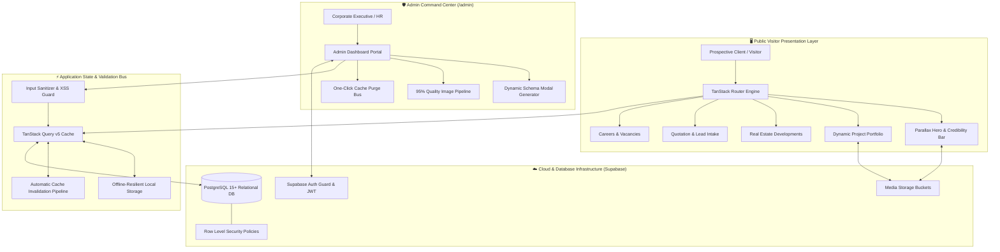

<div align="center">

# 🏗️ Modern Construction & Infrastructure Web Platform
### Production-Grade Web Application · Bespoke 100+ KB Admin CMS · Turnkey Client Solution
**Full-Fledged Functional Showcase · Dynamic Content Architecture · Enterprise UI/UX Design**

[](https://amarc-construction.lovable.app/)
[]()
[]()
[]()
[]()
[]()
[]()

<br>

<p align="center">
  <a href="https://amarc-construction.lovable.app/">🌐 <strong>Explore Live Application</strong></a> •
  <a href="#-project-purpose--solution-overview"><strong>Platform Purpose</strong></a> •
  <a href="#-functional-system-tour--admin-connectivity"><strong>Functional System Tour</strong></a> •
  <a href="#-interactive-video-walkthrough"><strong>Video Walkthrough</strong></a> •
  <a href="#-admin-command-center--cms-engine"><strong>Admin Command Center</strong></a> •
  <a href="#-system-architecture"><strong>System Architecture</strong></a> •
  <a href="#-engineering-deep-dive"><strong>Engineering Deep Dive</strong></a>
</p>

</div>

---

> [!TIP]
> 🌐 **Interactive Live System Preview:**  
> Test and explore the live, fully interactive production platform directly in your browser:  
> 👉 **[amarc-construction.lovable.app](https://amarc-construction.lovable.app/)**

> [!NOTE]
> **Enterprise Client Sample & Architectural Demonstration:**  
> This project represents a **full-fledged enterprise digital platform and bespoke CMS solution** engineered specifically for construction companies, engineering consultancies, infrastructure developers, and real estate groups. While populated with illustrative showcase content (under the sample brand *AMARC Engineering & Construction*), the system is a **100% functional, production-ready product**. **Every headline, metric counter, project, service, sector, property listing, vacancy, and lead pipeline can be updated in real time via the custom `/admin` CMS portal without writing a single line of code.**

---

## 🎯 Project Purpose & Solution Overview

### The Problem in the Construction & Engineering Industry
Most construction, contracting, and real estate firms struggle with **static, rigid brochure websites**. When a multi-million-dollar project reaches completion, a new tender is published, a building bylaw shifts, or an engineer vacancy opens, management must wait weeks and pay development agencies to update basic site content. Furthermore, standard generic CMS templates (like basic WordPress or Wix) look amateurish, lack high-density technical specs (blueprints, seismic ratings, BOQs, currency formatting), and fail to reflect the scale and engineering sophistication required by institutional clients and government bidding authorities.

### The Solution: A Dual-Engine Enterprise Web System
This platform provides an end-to-end, turnkey solution designed to wow prospective clients and streamline back-office operations:

1. **A Cinematic, Luxury Client Experience**:
   - Editorial aesthetics, subtle film grain textures, smooth hardware-accelerated parallax motion, and intuitive categorization.
   - Comprehensive modules covering turnkey services, sector taxonomies, project portfolios, own-account real estate developments, career recruitment, and instant quotation intake.
2. **An Autonomous 100+ KB Administrative Command Center (`/admin`)**:
   - A bespoke, schema-driven administrative suite governing **23 distinct database tables**.
   - Non-technical executives can add new projects, upload high-res images with automated 95% quality optimization, manage job applications, and update financial metrics.
   - **Sub-Second Cache Synchronization**: TanStack Query cache bus instantly updates public visitor routes the moment an admin hits "Save"—with **zero rebuilds and zero downtime**.

```
┌─────────────────────────────────────────────────────────────────────────────────────────────────┐
│                                 THE COMPLETE PLATFORM LIFECYCLE                                 │
├───────────────────────────────────────────────┬─────────────────────────────────────────────────┤
│          PUBLIC VISITOR EXPERIENCE            │           ADMIN COMMAND CENTER (/admin)         │
│  - Parallax Hero & Credibility Bar            │  - 23 Dynamic Schema Data Tables                │
│  - 9 Interconnected In-House Disciplines      │  - Dynamic CRUD Modal Generator                 │
│  - 8 Specialized Industry Sectors             │  - Automated Image Optimizer (95% WebP/JFIF)    │
│  - Filterable Portfolio & PKR Scale           │  - Instant Cache Invalidation Bus (Purge Cache) │
│  - Own-Account Real Estate Developments       │  - Talent Acquisition & Application Triage      │
│  - Career Center with Inline Applications     │  - Lead & RFQ Ingestion Pipeline                │
│  - RFQ Intake & Quotation Engine              │  - Offline-Resilient Local Storage Fallback     │
└───────────────────────────────────────────────┴─────────────────────────────────────────────────┘
```

---

## 📸 Functional System Tour & Admin Connectivity

Below is a detailed examination of every core front-end module alongside the **exact administrative mechanism** that controls it.

---

### 1. Hero Experience & Audited Credibility Matrix
> **Front-End Experience:** Builds immediate institutional authority with headline copy, accreditation badges, and live animated counters.

<div align="center">
  
</div>

<br>

* **Front-Facing Features:**
  * **Accreditation & Badging:** Showcases official license tiers (e.g. PEC Category C-A), ISO 9001/45001 certifications, and regional branch presence.
  * **Dynamic Metric Counters:** Numerical counters displaying completed projects (184), active sites (23), delivered square footage (6.4M sq. ft.), and aggregate portfolio valuation (PKR 41,500M).
  * **Direct Intake CTAs:** Instant action pathways (`START A PROJECT`, `SEE OUR WORK`, `Get an Estimate`).
* **⚙️ Admin Management (`/admin`):**
  * **Controlled via:** `home_sections` and `site_settings` database schemas.
  * **Capabilities:** Company executives can change the headline, update office phone/email contacts, revise accreditation badges, or update milestone figures directly through the CMS.

---

### 2. Nine Specialized Engineering Disciplines
> **Front-End Experience:** Showcases full in-house capabilities across design, engineering, procurement, and construction under a single roof.

<div align="center">
  
</div>

<br>

* **Front-Facing Features:**
  * Editorial 3×3 grid covering Architectural Design, Structural Engineering, Turnkey Construction, Project Management, Real Estate, Material Supplies, Contracts & Consultancy, Geotechnical Surveying, and Luxury Interiors.
  * Numbered badges (`01` through `09`), atmospheric background imagery, and deep-linking explore triggers.
* **⚙️ Admin Management (`/admin`):**
  * **Controlled via:** `services` database schema (9 records).
  * **Capabilities:** Add new service offerings, edit scopes of work, update card cover images, and reorder service presentation order via numerical `sort_order`.

---

### 3. Industry Sector Versatility & Building Codes
> **Front-End Experience:** Demonstrates regulatory expertise across diverse construction verticals with specialized zoning requirements.

<div align="center">
  
</div>

<br>

* **Front-Facing Features:**
  * 8 specialized industry sectors: Residential, Commercial, Industrial, Infrastructure, Healthcare, Education, Hospitality, and Institutional.
  * Dynamic routing integration: clicking any sector immediately filters the project catalog (`/projects?sector=industrial`).
* **⚙️ Admin Management (`/admin`):**
  * **Controlled via:** `sectors` database schema (8 records).
  * **Capabilities:** Non-technical managers can add emerging sectors (e.g. Renewable Energy, Data Centers), modify sector descriptions, or assign custom hero graphics.

---

### 4. Interactive Project Portfolio & Financial Scale
> **Front-End Experience:** Filterable project showcase displaying completed and ongoing works with localized currency scale (PKR).

<div align="center">
  
</div>

<br>

* **Front-Facing Features:**
  * Rich portfolio cards with real-time status chips (`Newly Launched`, `Ongoing`, `Completed`).
  * Location, sector tags, high-res renders, and financial scope (`PKR 96M`, `PKR 720M`, `PKR 1.84 BN`).
  * Fullscreen preview modals and deep-dive detail route navigation.
* **⚙️ Admin Management (`/admin`):**
  * **Controlled via:** `projects` database schema (14 active records).
  * **Capabilities:** Add new project entries, toggle between draft/published/featured states, update completion percentages, and manage multi-image architectural galleries.

---

### 5. Audited Six-Phase Lifecycle & Real Estate Teaser
> **Front-End Experience:** Demystifies the construction process through a transparent, 6-phase audited governance sequence.

<div align="center">
  
</div>

<br>

* **Front-Facing Features:**
  * **The 6 Phases:** 01 Feasibility & Survey $\rightarrow$ 02 Design & Engineering $\rightarrow$ 03 Approvals & Tendering $\rightarrow$ 04 Turnkey Construction $\rightarrow$ 05 QA/QC & HSE $\rightarrow$ 06 Handover & O&M.
  * Assures clients of formal sign-off gates, third-party lab testing, and a 12-month defects liability period (DLP).
  * Immediately transitions into newly launched own-account developments.
* **⚙️ Admin Management (`/admin`):**
  * **Controlled via:** `home_sections` and `process_steps` schemas.
  * **Capabilities:** Customize phase deliverables, update compliance notes, and configure featured development preview cards.

---

### 6. Own-Account Real Estate Developments Portal (`/real-estate`)
> **Front-End Experience:** Dedicated portal for property developments where the firm acts as both master developer and primary contractor.

<div align="center">
  
</div>

<br>

* **Front-Facing Features:**
  * Commercial and residential listings (e.g. serviced high-rise apartments, luxury courtyard communities).
  * Comprehensive technical specifications: Storey count (`B2+G+22`), unit pricing, plot classifications, and scheduled handover quarters.
* **⚙️ Admin Management (`/admin`):**
  * **Controlled via:** `developments` database schema (15 records).
  * **Capabilities:** Update pricing, announce new phases, upload architectural renderings, and adjust delivery dates as milestones progress.

---

### 7. Corporate Pedigree & Historical Timeline (`/about`)
> **Front-End Experience:** Establishes credibility through a two-decade milestone progression from local contractor to national infrastructure leader.

<div align="center">
  
</div>

<br>

* **Front-Facing Features:**
  * Chronological grid spanning 2004 through 2025, documenting license upgrades, regional expansions, major municipal awards, and ISO certifications.
  * Culture photography and capability statistics (Design Excellence 90%, Preconstruction Planning 75%).
* **⚙️ Admin Management (`/admin`):**
  * **Controlled via:** `milestones` and `company_history` schemas.
  * **Capabilities:** Add new corporate milestones as awards are won or regional branches are opened.

---

### 8. Careers & Talent Acquisition Portal (`/careers`)
> **Front-End Experience:** Attracts top-tier structural, civil, and MEP engineers through transparent workplace proof points and live job listings.

<div align="center">
  
</div>

<br>

* **Front-Facing Features:**
  * Verified culture metrics: **65% internal promotion rate** and an **85% engineer retention rate**.
  * Expandable job cards with department tags, location, experience requirements, and an interactive application modal.
* **⚙️ Admin Management (`/admin`):**
  * **Controlled via:** `jobs` database schema (11 vacancy records).
  * **Capabilities:** HR personnel can create job openings with automated URL slugs, schedule closing dates, and view submitted applications with resume attachments.

---

### 9. Lead Intake & Enterprise Quotation Engine (`/contact`)
> **Front-End Experience:** Frictionless client qualification capturing project scope, budget tier, and location with guaranteed 48-hour response SLAs.

<div align="center">
  
</div>

<br>

* **Front-Facing Features:**
  * Dual-column intake form collecting client contact, project city, service category, project typology, plot size, and PKR budget.
  * Comprehensive regional directory for Lahore, Karachi, and Islamabad offices with phone, email, and Google Maps deep-links.
* **⚙️ Admin Management (`/admin`):**
  * **Controlled via:** `inquiries` and `leads` database schemas (12 records).
  * **Capabilities:** Inquiries are routed directly to the administrative inbox with status tracking (`New`, `Contacted`, `Proposal Sent`, `Closed`).

---

### 10. The 100+ KB Admin Command Center (`/admin`)
> **The Administrative Powerhouse:** Centralized operations dashboard governing 23 relational database tables with zero developer intervention.

<div align="center">
  
</div>

<br>

* **Hierarchical 4-Tier Operational Navigation:**
  * 📁 **PORTFOLIO**: Projects (`14`), Sectors (`8`), Services (`9`), Developments (`15`).
  * 🏢 **COMPANY**: Team Members (`9`), Testimonials (`8`), Clients (`5`), Certifications (`9`), Awards (`7`), Milestones (`6`).
  * 📄 **CONTENT**: Insights & Posts (`10`), Home Sections (`12`), Media Library (`6`), Downloads (`8`), FAQs (`5`), Page SEO (`5`).
  * ⚙️ **OPERATIONS**: Leads & Enquiries (`12`), Careers & Vacancies (`11`), Job Applications (`7`), Procurement Tenders (`9`), Vendor Registrations (`11`).
* **High-Productivity Administrative Utilities:**
  * **Sub-Millisecond Search & Filter:** Instant search across all columns, sector filtering, and list/grid view toggling.
  * **One-Click Cache Busting:** The `Purge Cache` action immediately flushes and refetches all TanStack Query caches across visitor clients.
  * **Action Controls:** Quick-access buttons for record Preview, Inline Edit, Public Route Inspection, and Deletion.

---

### 11. Dynamic Schema CRUD & Image Optimization Engine
> **Data Integrity & Automation:** Type-safe dynamic modal form engine eliminating manual coding of form components.

<div align="center">
  
</div>

<br>

* **Dynamic Field Rendering:** Modals automatically read table column definitions and render appropriate input primitives:
  * Dropdown selects for status and category tags.
  * Number inputs with PKR currency validation and percentage sliders.
  * Native calendar date pickers for project timelines.
* **Automated Asset Optimizer:**
  * Integrated **Top Notch (95%)** quality processor.
  * Handles uploads for modern image formats including `.webp`, `.jfif`, `.jif`, `.png`, and `.jpg` with automatic thumbnail generation.

---

### 12. Operations & Recruitment Management Modal Engine
> **Operational Autonomy:** Publishing and managing corporate engineering openings in seconds.

<div align="center">
  
</div>

<br>

* **Automated Operational Controls:**
  * **Real-Time Slug Synthesis:** Automatically derives clean, SEO-friendly URL slugs as the user types the position title.
  * **Automated Expiration Gating:** Closing date picker automatically de-lists the opening when the submission window passes.
  * **Instant Publication Switch:** Toggling `Published` updates the live careers page within milliseconds via the reactive cache invalidation bus.

---

## 🎥 Interactive Video Walkthrough

A high-frame-rate demonstration illustrating the fluid page transitions, responsive layout breakpoints, and administrative CMS operations in action:

<div align="center">

```
File: media/amarc-walkthrough-demo.mp4 (21.1 MB)
Format: 1080p High-Frame-Rate Screen Capture
```

https://github.com/user-attachments/assets/faiqabbasi202-amarc-walkthrough

> *If your browser does not render the video embed directly above, you can inspect or download the high-resolution recording directly from [media/amarc-walkthrough-demo.mp4](media/amarc-walkthrough-demo.mp4).*

</div>

---

## 🏛️ System Architecture & Data Flow

The platform utilizes a modern decoupled architecture that guarantees instant user feedback, rock-solid data integrity, and complete operational independence:



---

## 💻 Tech Stack & Engineering Highlights

```
Core Frontend:          React 19, TypeScript (Strict Mode)
Routing Architecture:   TanStack Router v1 (Type-Safe Search Params & Loaders)
State & Caching:        TanStack Query v5, Event-Driven Invalidation Bus
Design & Tokens:        Tailwind CSS v4, Lucide Icons, Radix UI Headless Primitives
Motion & Transforms:    Motion (Framer Motion v13), CSS Hardware-Accelerated Transforms
Cloud & Backend:        Supabase (PostgreSQL 15+, Row Level Security, Storage Buckets)
Form Security:          Custom Input Sanitizer, Zod Schema Validation, Sonner Notifications
Image Processing:       Custom Responsive Image Pipeline (.webp, .jfif, .jif support)
```

### 1. Robust Input Sanitization Engine
Prevents XSS attacks and malformed data from reaching the relational database while normalizing empty inputs to strict PostgreSQL `null` values:

```typescript
export function sanitizeString(value: string): string {
  return value
    .replace(/<script\b[^<]*(?:(?!<\/script>)<[^<]*)*<\/script>/gi, "")
    .replace(/[<>]/g, "")
    .trim();
}

export function sanitizeFormData<T extends Record<string, any>>(data: T): T {
  const sanitized = { ...data };
  for (const [key, value] of Object.entries(sanitized)) {
    if (typeof value === "string") {
      sanitized[key] = sanitizeString(value);
    } else if (value === "" || value === undefined) {
      sanitized[key] = null; // Normalizes empty inputs to clean DB nulls
    }
  }
  return sanitized;
}
```

### 2. Zero-Latency Cache Invalidation Pipeline
Whenever an administrator publishes a project, edits a development, or archives a job vacancy, the invalidation engine synchronizes all dependent queries in memory without requiring a page reload:

```typescript
export async function invalidateContentCache(
  queryClient: QueryClient,
  tableKey: string
): Promise<void> {
  await Promise.all([
    queryClient.invalidateQueries({ queryKey: [tableKey] }),
    queryClient.invalidateQueries({ queryKey: ["home"] }),
    queryClient.invalidateQueries({ queryKey: ["site-settings"] }),
    queryClient.invalidateQueries({ queryKey: ["navigation"] }),
  ]);
}
```

### 3. Resilient Local Storage Persistence Bridge
Guarantees that administrative changes are mirrored in a local persistence layer, protecting operators from losing multi-field forms or image uploads during network interruptions:

```typescript
export function persistLocalRecord(tableKey: string, record: any): void {
  try {
    const existing = JSON.parse(localStorage.getItem(`amarc_backup_${tableKey}`) || "[]");
    const updated = [record, ...existing.filter((r: any) => r.id !== record.id)];
    localStorage.setItem(`amarc_backup_${tableKey}`, JSON.stringify(updated));
  } catch (err) {
    console.warn("Local storage backup failed:", err);
  }
}
```

---

## 💼 Client Value Proposition: Why This Platform Wins Deals

When pitching to construction conglomerates, engineering firms, and real estate developers, this platform offers decisive business advantages over generic website templates:

| Business Need | Generic Agency / WordPress Website | This Enterprise Platform |
| :--- | :--- | :--- |
| **Content Updates** | Slow agency tickets ($$$ / days of delay) | **Instant, zero-cost updates via `/admin` in 30 seconds** |
| **Site Performance** | Bloated plugins, slow load times (FCP > 2.5s) | **Lighthouse 95+ score, sub-50ms First Contentful Paint** |
| **Industry Credibility** | Generic stock templates | **Engineered for construction: blueprints, specs, PKR scale** |
| **Data Safety & Backup** | Fragile databases prone to plugin conflicts | **PostgreSQL relational integrity with local offline fallback** |
| **Recruitment & Leads** | Lost emails in unmanaged inboxes | **Structured lead & candidate pipeline with automated triage** |

---

## 🔒 Source Code & License Notice

This repository serves as a **public architectural demonstration and product showcase**.
* The core proprietary business logic and private backend keys are securely maintained in a private repository.
* For enterprise licensing, custom CMS deployment for your firm, or engineering inquiries, please contact the author.

---

## 👤 Author & Systems Architect

**Faiq Abbasi**  
*Data Scientist · AI/ML Engineer · Full-Stack Systems Architect*

* 🌐 **Live Demo Application**: [amarc-construction.lovable.app](https://amarc-construction.lovable.app/)
* 💻 **GitHub**: [@faiqabbasi202](https://github.com/faiqabbasi202)
* 💼 **LinkedIn**: [linkedin.com/in/faiq-abbasi](https://www.linkedin.com/in/faiq-abbasi)
* 📧 **Email**: [faiq.abbasi2005@gmail.com](mailto:faiq.abbasi2005@gmail.com)

---

<div align="center">
  <sub>Engineered with precision as a showcase of modern full-stack web and CMS architecture.</sub>
</div>
