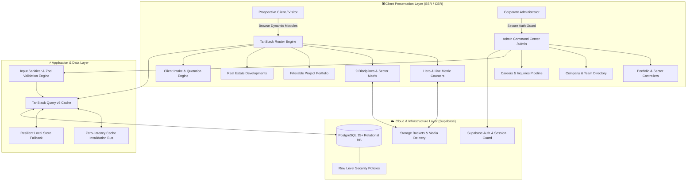

# System Architecture & Technical Specifications

> **Platform:** Enterprise Construction & Infrastructure Web Solution  
> **Engineered by:** Faiq Abbasi  
> **Classification:** Full-Fledged Web Application & Bespoke 100+ KB Admin CMS Engine  
> **Live Demo:** [amarc-construction.lovable.app](https://amarc-construction.lovable.app/)

---

## 1. System Overview & Platform Mission

This platform is engineered as a **turnkey enterprise digital product** designed to showcase modern web architecture for the construction, engineering, contracting, and real estate industries. 

Rather than relying on static pages or generic third-party website builders, this system demonstrates how a multi-disciplinary construction company can achieve complete operational independence. **Every single front-end module—from hero statistics and project portfolios to service matrices, job vacancies, and lead capture forms—is dynamically mapped to a relational database and instantly editable via a bespoke 100+ KB `/admin` CMS portal.**

---

## 2. Technology Stack & Architectural Decisions

| Layer | Technology | Decision Rationale |
| :--- | :--- | :--- |
| **Framework** | **React 19 & TypeScript** | Modern concurrent rendering, strict type safety, zero compile-time compromises. |
| **Routing** | **TanStack Router / Start** | Fully type-safe routing, search params validation, loader-driven suspense data pre-fetching. |
| **Styling** | **Tailwind CSS v4** | Next-generation performance, CSS variables-first architecture, responsive utility design. |
| **Motion** | **Motion (Framer Motion v13)** | Fluid hardware-accelerated parallax, reveal animations, spring transitions without frame drops. |
| **UI Components** | **Radix UI Primitives** | Unstyled, accessible (WAI-ARIA compliant) headless primitives customized for quiet luxury aesthetic. |
| **State & Cache** | **TanStack Query v5** | Declarative asynchronous caching, automatic background refetching, optimistic UI updates. |
| **Backend & DB** | **Supabase (PostgreSQL 15+)** | Relational data integrity, Row Level Security (RLS), instant API generation, asset buckets. |
| **Validation** | **Custom Input Sanitizer & Zod** | Deep sanitization of rich text and form inputs to eliminate XSS and injection vulnerabilities. |

---

## 3. The 100+ KB Administrative CMS Engine

The administration command center (`/admin`) is an autonomous engine designed to provide non-technical corporate staff with 100% control over their website:

1. **Schema-Driven Modal Generator**:
   - The UI does not use hardcoded forms. Instead, modals inspect table schema configurations to dynamically render text, numeric, date, select, tag, image, and gallery controls.
2. **Sub-Second Cache Invalidation**:
   - Integrated with TanStack Query's invalidation pipeline (`invalidateContentCache()`), ensuring public visitor routes immediately reflect content changes without rebuilds or server restarts.
3. **Resilient Local Persistence Fallback**:
   - `mergeWithLocalRecords()` and `persistLocalRecord()` guarantee zero administrative data loss during network interruptions or API limits.
4. **Automated 95% Quality Asset Optimization**:
   - Built-in image processing pipeline supporting contemporary `.webp`, `.jfif`, and `.jif` uploads with automatic thumbnail generation.
