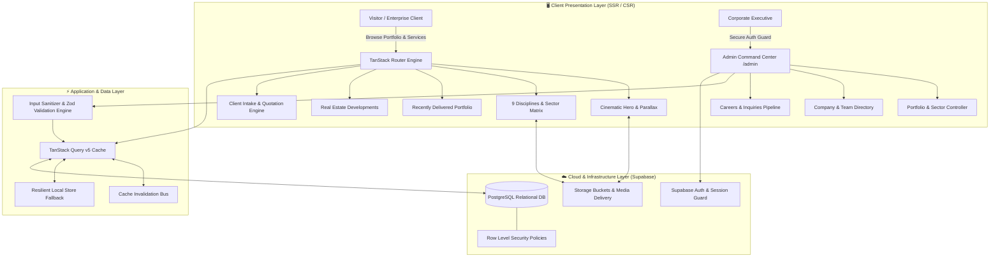
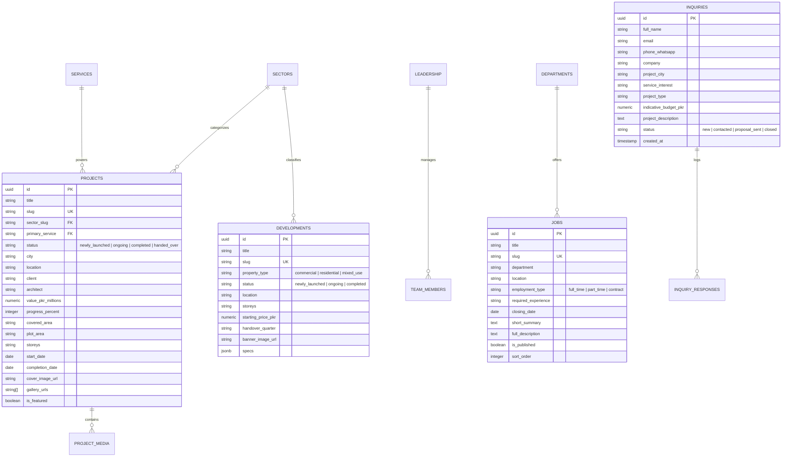

# System Architecture & Technical Specifications

> **Project:** AMARC Engineering & Construction Portal (`amarc.com.pk`)  
> **Engineered by:** Faiq Abbasi  
> **Architecture Classification:** Enterprise Web Portal & Bespoke 100+ KB CMS Engine

---

## 1. System Overview

**AMARC Engineering & Construction** is an enterprise-tier web platform engineered for one of Pakistan's leading multi-disciplinary construction conglomerates. The system pairs an ultra-responsive, motion-enhanced client portal with an autonomous 100+ KB administrative CMS, enabling non-technical operators to control all site content, multi-billion PKR project portfolios, real estate developments, career listings, and client inquiries in real time.

---

## 2. Technology Stack & Rationale

| Layer | Technology | Decision Rationale |
| :--- | :--- | :--- |
| **Framework** | **React 19 & TypeScript** | Modern concurrent rendering, strict type safety, zero compile-time compromises. |
| **Routing** | **TanStack Router / Start** | Fully type-safe routing, search params validation, loader-driven suspense data pre-fetching. |
| **Styling** | **Tailwind CSS v4** | Next-generation performance, CSS variables-first architecture, responsive utility design. |
| **Motion** | **Motion (Framer Motion v13)** | Fluid hardware-accelerated parallax, reveal animations, spring transitions without frame drops. |
| **UI Components** | **Radix UI Primitives** | Unstyled, accessible (WAI-ARIA compliant) headless primitives customized for quiet luxury aesthetic. |
| **State & Cache** | **TanStack Query v5** | Declarative asynchronous caching, automatic background refetching, optimistic UI updates. |
| **Backend & DB** | **Supabase (PostgreSQL 15+)** | Relational data integrity, Row Level Security (RLS), instant API generation, asset buckets. |
| **Validation** | **Custom Input Sanitizer & Zod** | Deep sanitization of rich text and form inputs to eliminate XSS and injection vulnerabilities. |

---

## 3. Data Architecture & Relational Schema

The data model is engineered around 23 tables structured within Supabase PostgreSQL:

---

## 4. Administrative CMS Engineering (`/admin`)

The admin command center spans **100+ KB of robust TypeScript logic** designed for enterprise operations:

1. **Zero-Code Content Ingestion**:
   - Dynamic schema mapping via metadata tables.
   - Modals auto-render input types (`text`, `textarea`, `number`, `boolean`, `image`, `gallery`, `select`, `date`, `tags`) dynamically based on table metadata.
2. **Resilient Offline / Fallback Storage Layer**:
   - `mergeWithLocalRecords()`, `persistLocalRecord()`, and `removeLocalRecord()` ensure zero data loss during network hiccups or API rate limits.
3. **Cache Synchronization**:
   - Integrated with TanStack Query's cache invalidation bus (`invalidateContentCache()`), ensuring public visitor routes immediately reflect content changes without rebuilds or server restarts.
4. **Input Sanitization & Security**:
   - Centralized `sanitizeFormData()` strips malicious script payloads before persistence.
   - Enforces strict slug formatting, character length constraints, and required field validation.

---

## 5. Performance, SEO & Core Web Vitals

* **Suspense & Progressive Hydration**: Data loaders pre-populate critical above-the-fold queries (`homeQuery`, `siteSettingsQuery`, `pageSeoQuery`).
* **Adaptive Media Optimization**: Dedicated `ResponsiveImage` primitive serves responsive desktop and mobile asset variants with intrinsic aspect ratios and blur placeholders.
* **SEO Metadata Engine**:
  - Dynamically builds Open Graph, Twitter Cards, canonical links, and JSON-LD schema on a per-route basis.
  - Generates rich snippet schemas for construction projects, local business credentials, and corporate leadership.
* **Accessibility**: Full keyboard navigation, screen-reader annotations, focus trapping in modal dialogs, and reduced-motion mode via `useReducedMotion()`.
