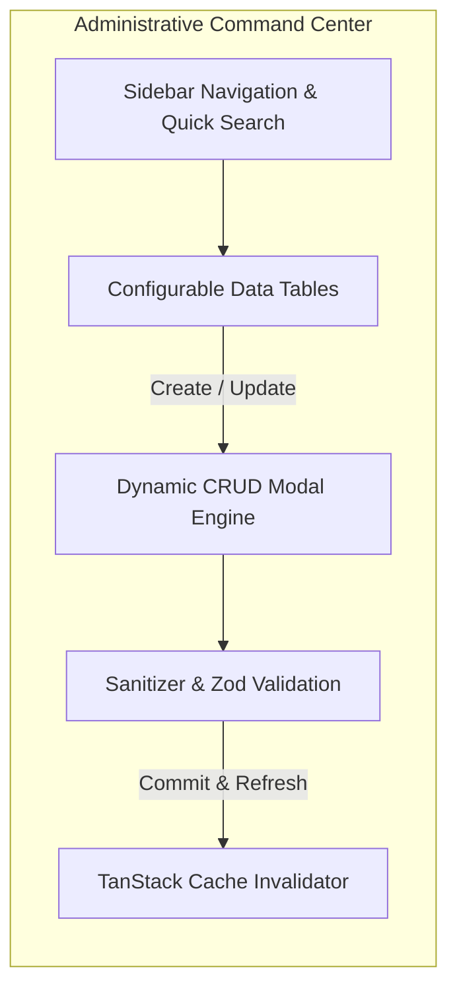

# Functional Specifications & Feature Catalog

> **Project:** AMARC Engineering & Construction Portal (`amarc.com.pk`)  
> **Target Audience:** Enterprise Clients, Real Estate Investors, Engineering Authorities & Corporate Administrators

---

## 🏛️ 1. Client-Facing Public Platform

### 1.1 Cinematic Parallax Hero & Credibility Bar
* **Parallax Motion**: Hardware-accelerated depth scrolling utilizing Framer Motion transforms and subtle architectural film grain.
* **Pakistani Industry Credibility**: Prominently highlights **Pakistan Engineering Council (PEC) Category C-A**, ISO 9001/45001 safety credentials, and 20 years of turnkey operation.
* **Live Counter Metrics**: Verified database counters displaying completed projects (184), active job sites (23), square footage delivered (6.4M sq. ft.), and aggregate contract value (PKR 41,500M).

### 1.2 Nine Disciplines In-House Integration (`/services`)
* Comprehensive breakdowns of AMARC's nine core capabilities:
  1. **Architectural Design** (Concept to construction drawings)
  2. **Structural Design** (RCC, steel design, seismic vetting)
  3. **Construction Services** (Turnkey grey structure and finishing)
  4. **Project Management** (Cost control, milestone supervision)
  5. **Real Estate** (Turnkey development and asset sales)
  6. **Material Supplies** (Bulk certified steel, cement, finishing fixtures)
  7. **Contracts & Consultancy** (FIDIC drafting, BOQ preparation, claims)
  8. **Topography & Geotechnical** (Total-station surveying, SPT boreholes)
  9. **Interior Design** (Luxury interior architecture, custom joinery)

### 1.3 Multi-Sector Project Showcase (`/projects`)
* **Dynamic Sector Filtering**:
  - Filter across **Residential, Commercial, Industrial, Infrastructure, Healthcare, Education, Hospitality, and Institutional**.
* **Interactive Project Cards**:
  - Status badges (`Newly Launched`, `Ongoing`, `Completed`, `Handed Over`).
  - Metadata pills for City, Location, Value in PKR, and Engineering Scope.
* **Deep-Dive Project Detail Views**:
  - High-resolution interactive photo gallery with responsive zoom.
  - Financial scale formatted in Pakistani Rupees (`PKR 96M`, `PKR 720M`, `PKR 1.84B`).

### 1.4 Commercial & Residential Real Estate Hub (`/real-estate`)
* **Development Matrix**:
  - Displays high-value real estate projects where AMARC is both developer and contractor:
    - **AMARC Vantage** (Main Boulevard, Gulberg III, Lahore — B2+G+22 storeys, from PKR 24.5M)
    - **AMARC Courtyard Homes** (Sector M, DHA Phase 9 Prism, Lahore — G+1 courtyard villas, from PKR 41.0M)
    - **AMARC Trade Centre** (Susan Road — Modern commercial trade complex, from PKR 8.9M)
  - Detailed unit specs, total storeys, and target completion dates.

### 1.5 Talent & Career Center (`/careers`)
* Departmental listings for Site Engineers, Structural Design Engineers, Quantity Surveyors, and Safety Officers.
* Transparent corporate culture metrics (**65% internal promotion rate**, **85% retention rate**).
* Interactive application modal with PDF CV attachment handling.

### 1.6 Corporate Pedigree & Historical Timeline (`/about`)
* Comprehensive timeline documenting two decades of growth from 2004 to 2025:
  - Founding in Lahore (2004) $\rightarrow$ Turnkey milestone (2008) $\rightarrow$ PEC C-A upgrade (2012) $\rightarrow$ Karachi expansion (2015) $\rightarrow$ LDA infrastructure contracts (2018) $\rightarrow$ ISO 9001/45001 certification (2021) $\rightarrow$ Gulberg Corporate Tower (2023) $\rightarrow$ AMARC Vantage (2025).

### 1.7 Interactive Inquiries & Quotation Engine (`/contact`)
* Low-friction client intake form capturing project city, service category, project type, plot parameters, and budget tier in PKR.
* Guaranteed 48-hour feasibility response SLA.
* Tri-city regional office directory (Lahore, Karachi, Islamabad).

---

## ⚙️ 2. Enterprise Admin CMS Portal (`/admin`)

The `/admin` portal provides complete operational independence for company leadership without requiring developer interventions.

### 2.1 Content & Data Management Capabilities
* **Portfolio Control**:
  - Add, edit, or archive Projects, Services, Sectors, and Developments.
  - Dynamic slug auto-generation from titles.
  - Multi-image gallery upload with primary poster assignment and 95% quality optimizer.
* **Corporate Governance Management**:
  - Executive Leadership directory and bios.
  - Client roster & logo management.
  - National & International awards, safety certifications, and compliance standards.
  - High-impact client testimonials with verification details.
* **Operational Workflow Hub**:
  - **Career Board**: Publish and close job vacancies in real-time with automated expiration dates.
  - **Lead Tracking Center**: Review incoming customer inquiries with status flags (`New`, `Contacted`, `Proposal Sent`, `Closed`).

### 2.2 Operational Utilities & UX Features
* **Global Instant Search**: Sub-millisecond record search across all database columns.
* **Grid vs. Table View**: Toggle between dense tabular data and visual card previews.
* **Inline Sorting & Status Filtering**: Sort by date, budget, status, or city with one click.
* **Input Sanitization & Safe Form Submission**: Centralized data sanitizer prevents malicious script execution and malformed JSON entries.
* **Local Storage Persistence Fallback**: If network connectivity drops during an update, edits are preserved locally so no administrative work is lost.
